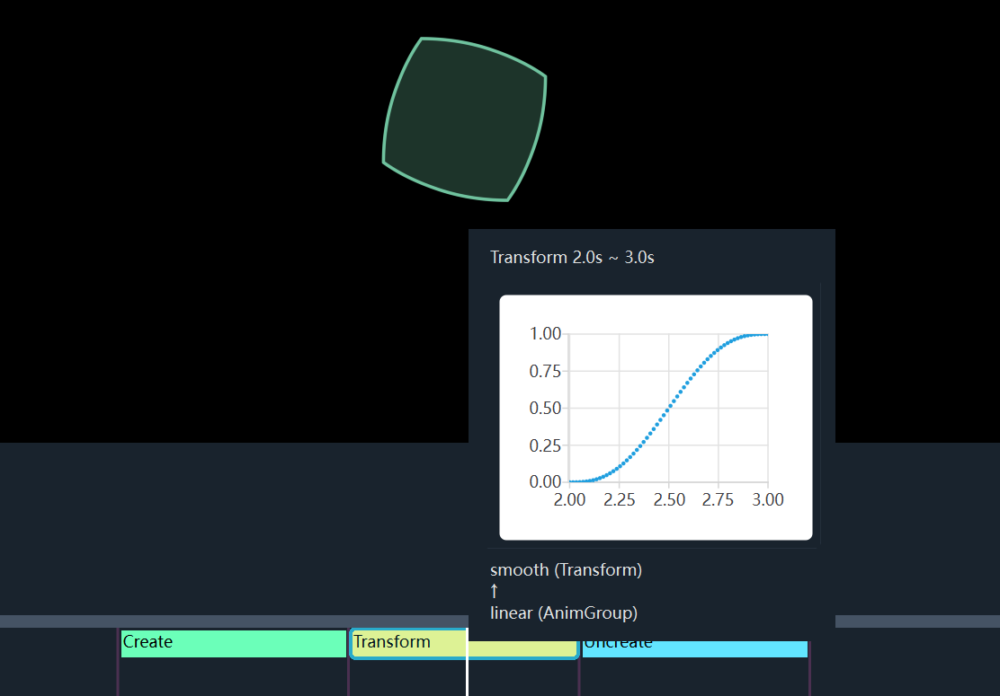

界面使用
============

基本介绍
------------

界面元素
~~~~~~~~~~~~

.. image:: ../_static/images/use_gui.png
    :align: center
    :scale: 50%

如上图，整个界面主要分为两个部分

- 上面黑色背景的这块是显示画面
- 下面带有各个动画标签的是时间轴

进度控制
~~~~~~~~~~~

| 按下空格键控制播放和暂停
| 如果播放到了末尾按下空格键，会从头播放

也可以在时间轴中左键拖动当前时刻，调整到你要查看的地方

时间轴显示区段控制
~~~~~~~~~~~~~~~~~~~~~~~~

你可以使用 “WASD” 来控制在时间轴上的区段：

.. list-table::

    *   -
        -   W 放大
        -
    *   -   A 左移
        -   S 缩小
        -   D 右移

.. raw:: html

    <del>有点像 FPS 游戏的键位</del>

窗口位置
~~~~~~~~~~~~

默认的窗口位置是占据右半边屏幕，你可以通过自定义配置来更改

你可以修改全局配置，在命令行参数中加上 ``-c wnd_pos UR``，比如：

.. code-block:: sh

    janim run your_file.py YourTimeline -c wnd_pos UR

.. note::

    修改全局配置的格式是 ``-c 配置名 值``，更多的配置请参考 :class:`~.Config`

``UR`` 表示 ``UP & RIGHT``，即窗口占据屏幕右上角

也就是说，前一个字符表示在纵向的位置，后一个字符表示在横向的位置

以下是可用的位置字符（括号内表示这个字符的含义）：

.. list-table::

    *   -   U (UP)
        -   上方
    *   -   O
        -   占据整个纵向长度
    *   -   D (DOWN)
        -   下方

.. list-table::

    *   -   L (LEFT)
        -   O
        -   R (RIGHT)
    *   -   左侧
        -   占据整个横向长度
        -   右侧

除了修改全局配置，你也可以修改时间轴配置，请参考：:class:`~.Config`

进阶功能
------------

具体信息
~~~~~~~~~~~~

鼠标悬停在时间轴动画标签上可以显示具体信息，例如时间区段、插值函数散点图等

子物件选择
~~~~~~~~~~~~

.. note::

    有待编写

富文本编辑
~~~~~~~~~~~~

.. note::

    有待编写
